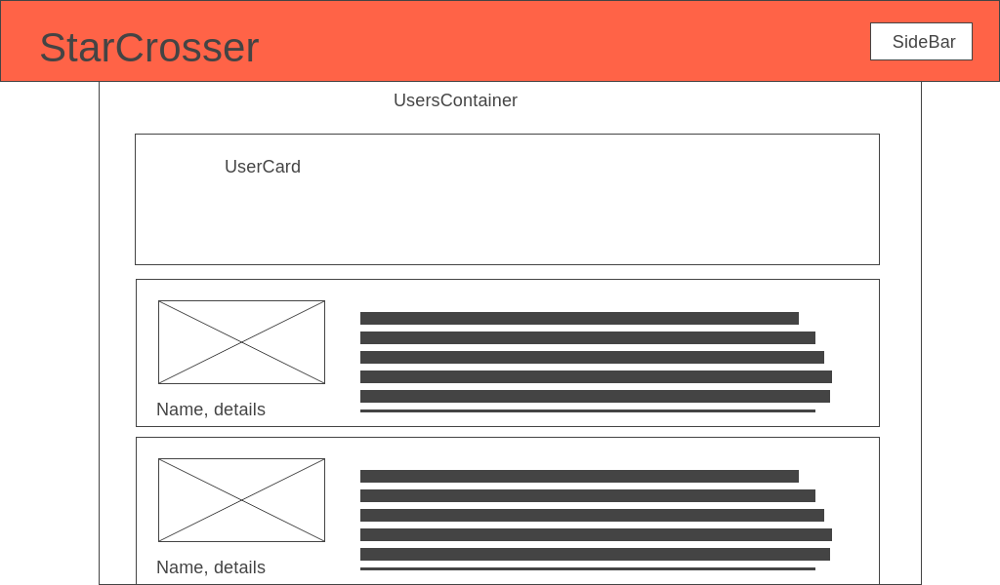

# Project Overview
For this project I want to make a dating app, with an astrology spin. So that users can find each other according to their star signs and horoscopes. I thought it would be a fun way to show everything I've learned while at Flatiron, while playing around with some frontend and backend skills that I want to expand on. The styling will be done in Semantic UI.

### The Backend:

Here's the link to the backend repo: https://github.com/MitchellGoodwin/Star-Crosser-Backend

## Expected General User Flow and Frontend Routes:

### /root

The rootpage will be a welcome page, that depending on if the user is logged in or not, while either prompt them to log in/sign up, or welcome the user by name. If not logged in, the user will be redirected back to here if they try and go to any routes besides login/signup.

* Stretch goal: add an overview of the site here

### Auth Routes

/login, and /signup will lead to respective forms. On submit /login will authenticate the user and then redirect them to the welcome page. /signup will redirect them to the /my-profile page to fill out more details.

/logout will logout the user and then return them to the welcome page. 

All of these routes will be in the header in some ways.

### /my-profile

Will lead to an edit form for the logged in user, populated with their current information. Here is where they can set a profile image, as well as fill out their different bio sections. They can click a button to go to /my-profile/preview to see what their porfile page looks like to others. If they leave a bio section blank, it just wont show up.

### /explore

Shows all the other users, automatically filtered by gender preferences. Click on a user to go to their profile page. 

* Stretch goals:
* Filters for Age, Star Sign, Distance and others
* Filter by todays horroscope
* Lazy loading

### /profile/:id

Shows a profile page for another user.
Has a button to like that user, and a button to send them a message.

* Stetch goal: Button to block user

### /my-sign

Shows the current user's zodiac sign, with information about it. 

* Stretch Goals:
* Show info on their current daily compatable sign.
* Add a form to get their info to find their whole birthchart, then show that information.

### /inbox

The logged in user can read and send messages from and to the currently selected user.

They can pick the selected user from a list of users to the left.

They can filter the users by their own likes/matches.

The messagee users are sorted by most recent message.

Redux store will do a lot here.

* Implement websockets for live messaging
* Make it so they can't send a second message without a match from the other user.
* Can't message/ see users who have blocked you

## Header

It'll have the site title.

As well as login/ signup buttons if they are logged out.

If they are logged in, it will have a button to open up a popout sidebar

The sidebar will have buttons to:
* Profile
* Explore
* StarSign
* Inbox
* Logout

Stretch Goals:
* A footer with live notifications 
* A sidebar tab for account functions

## Component Hierarchy

## Important Redux Store Values

* current_user
* selected_user
* todays_horroscope
* users

# MVP daily plan

## Wednesday Afternoon

* Start Backend
* Create Models as Described in Preposal
* Implement Auth
* Seed From APIs

## Thursday

* Start Frontend
* Setup Routes
* Redux Setup
* Create Homepage
* Auth Forms/Routes

## Friday

* My Profile Form
* User Show Page
* Star Sign show

## Monday

* Explore Other Users
* Can Click to go to Show
* Can Like/Unlike
* Matches Setup

## Tuesday

* Inbox Setup
* Can See All Likes and Matches
* Can Message And See All Previous Messages

# Stretch Goals for Full Project

* Can look up full birthchart
* Can fill out a personality quiz
* Can sort users by astronomy or personality quiz- style it as science vs astrology
* WEBSOCKETS
* Email Integration
* Add a subscription setup with real payment integration
* Add restrictions for if not subscribed
* Add an ability to block users
* Add uploading photo files
